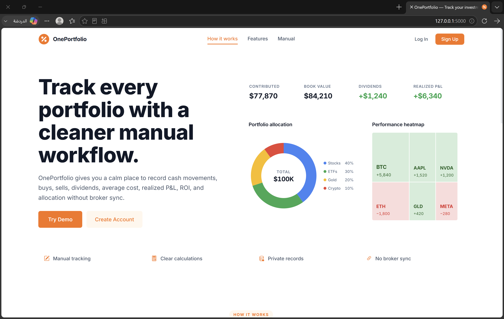

# OnePortfolio


> A Flask web app for organizing your investments and managing your capital by creating multiple portfolios under custom names of your choice — *Stocks*, *Gold*, *ETFs*, or whatever fits the way you think about your money. Each portfolio holds its own cash events, tracked symbols, transactions, and dividends; the app derives net deposits, cash balance, average cost, and realized P&L straight from those records. No external price feeds or broker integrations.
>
> Try it on the [live demo](https://oneportfolio.pythonanywhere.com/), or self-host your own instance.

## Table of Contents

- [How It Works](#-how-it-works)
- [Features](#-features)
- [Tech Stack](#️-tech-stack)
- [Live Demo](#-live-demo)
- [Quick Start](#-quick-start)
- [Configuration](#-configuration)
- [Project Structure](#-project-structure)
- [Architecture](#-architecture)
- [Testing](#-testing)
- [Deployment](#-deployment)
- [License](#-license)

## 🧭 How It Works

The data model centres on the **Portfolio** as a free-form named bucket — call it whatever fits the way you organise your money (e.g. "US Stocks", "Gold", "Crypto", "Retirement ETFs"). Each portfolio owns:

| Concept | What it is | Model |
|---------|-----------|-------|
| **Cash events** | Deposits, withdrawals, and the initial funding event — the single source of truth for net deposits | `PortfolioEvent` |
| **Tracked symbols** | Tickers you've added to the portfolio (a symbol can be tracked even before you buy it) | `Symbol` |
| **Transactions** | Buy / Sell entries for a symbol, with price, quantity, fees, and notes | `Transaction` |
| **Dividends** | Income events attributed to a specific symbol within the portfolio | `Dividend` |

From those four record types the app derives every number on the dashboard:

- **Net deposits** = Σ deposits − Σ withdrawals (read from events; never cached)
- **Available cash** = net deposits − Σ buy net amounts + Σ sell net amounts + Σ dividends
- **Average cost** per symbol = recomputed via the Average Cost Method (ACM) on every buy
- **Realized P&L** = computed on the fly per symbol from the transaction log (Σ (sell price − avg cost) × qty − fees, plus dividends), with no snapshot table to drift
- **Book value** = cost basis of open holdings + available cash
- **Overview ROI** = realized P&L ÷ Total Contributed
- **Transaction summary ROI** = realized P&L ÷ Total Spent (buy outflows including fees)

## ✨ Features

| Feature | Description |
|---------|-------------|
| **Named portfolios** | Create as many portfolios as you like — name them however you organise your investments |
| **Cash event log** | Deposits, withdrawals, and an initial funding event per portfolio, with full audit trail and inline edit/delete |
| **Tracked symbols** | Add tickers to a portfolio independently of any transaction; transactions referencing a new ticker also auto-add it |
| **Buy / Sell transactions** | Per-symbol entries with price, quantity, fees, date, and free-form notes (with a character counter) |
| **Average Cost Method** | Every buy recomputes the symbol's stored `average_cost` and `net_amount` |
| **Dividend tracking** | Record dividends per symbol; they flow into realized P&L |
| **Realized P&L (live)** | Computed dynamically from the transaction log — no snapshot to drift |
| **Per-portfolio metrics** | Total Contributed, Book Value, Realized P&L, ROI, Cost Basis, Available Cash |
| **Dashboard overview** | Aggregated totals across all portfolios (Total Contributed, Book Value, Total Dividends, Realized P&L) |
| **Charts page** | Allocation breakdown and realized P&L per portfolio |
| **Multi-user accounts** | Strict per-user data isolation — every read filters by `Portfolio.user_id`; the first registered user becomes admin |
| **Email verification** | 6-digit OTP sent on sign-up; sign-ups stage in `pending_registration` until confirmed |
| **Password reset** | Token-based reset link sent by email, expires in 1 hour |
| **Brute-force protection** | 5 failed logins → 30-minute lockout; rate limits on auth endpoints via Flask-Limiter |
| **Account settings** | Change password, change email (with re-verification), self-delete account with OTP |
| **Admin panel** | List users, send reset emails, toggle admin flag |
| **Responsive UI** | Bootstrap 5.3 layout with paginated symbol cards and event tables |

## 🛠️ Tech Stack

| Layer | Technology |
|-------|-----------|
| Backend | Python 3.8+ · Flask 3.0.0 |
| ORM / DB | Flask-SQLAlchemy 3.1.1 · SQLite |
| Auth | Flask-Login 0.6.3 · bcrypt (with legacy Werkzeug-PBKDF2 verification + auto-rehash) |
| Forms / CSRF | Flask-WTF 1.2.1 (CSRF only) + custom validation layer (`base_form.py`) |
| Rate limiting | Flask-Limiter (in-memory storage by default) |
| Email | Flask-Mail 0.10.0 over Gmail SMTP |
| Config | python-dotenv |
| Frontend | Bootstrap 5.3 · Bootstrap Icons · vanilla JS (single `InvestmentPortfolioApp` class) |
| Testing | pytest |

## 🌐 Live Demo

👉 https://oneportfolio.pythonanywhere.com/

**Demo credentials:**

| Field | Value |
|-------|-------|
| Username | `demo` |
| Password | `demo1234` |

## 🚀 Quick Start

**Prerequisites:** Python 3.8+

```bash
# 1. Clone
git clone https://github.com/nasserx/OnePortfolio.git
cd OnePortfolio

# 2. Virtual environment
python -m venv venv
source venv/bin/activate        # Linux / macOS
.\venv\Scripts\activate         # Windows

# 3. Install dependencies
pip install -r requirements.txt

# 4. Run the dev server
python app.py                   # http://localhost:5000  (debug=True)
```

The first registered account is automatically promoted to admin.

> **Dev tip:** set `DEV_AUTO_LOGIN=1` in your environment to skip the login screen and auto-login as the first user. Never enable this in production.

## 🔧 Configuration

All configuration is read from environment variables (place them in a `.env` file or your host's WSGI panel):

| Variable | Required | Description |
|----------|----------|-------------|
| `SECRET_KEY` | ✅ in production | Flask session signing key — generate with `secrets.token_hex(32)`. A dev fallback is used unless `FLASK_ENV=production`. |
| `EMAIL_USER` | ✅ | Gmail address used to send verification, reset, and account-deletion emails |
| `EMAIL_PASSWORD` | ✅ | Gmail App Password (requires 2FA on the sending account) |
| `APP_BASE_URL` | ✅ | Public base URL used inside email links (no trailing slash) |
| `DATABASE_URL` | — | SQLAlchemy URI — defaults to `sqlite:///portfolio.db` |
| `SESSION_COOKIE_SECURE` | — | `1` to set `Secure` on session and remember-me cookies (HTTPS only) |
| `DEV_AUTO_LOGIN` | — | `1` to auto-login as the first user (development only) |
| `FLASK_ENV` | — | Set to `production` to enforce a real `SECRET_KEY` |

> Gmail accepts only [App Passwords](https://myaccount.google.com/apppasswords) here — your regular account password will not work.

## 📁 Project Structure

```
OnePortfolio/
├── app.py                      # Dev entry point (debug=True, localhost:5000)
├── wsgi.py                     # Production WSGI entry — exposes `application = create_app()`
├── config.py                   # Env-driven configuration
├── conftest.py                 # pytest fixtures (test DB, client, auth helpers)
├── init_db.py                  # Standalone DB initialization helper
├── requirements.txt
├── test_app.py                 # Main test suite
├── test_auth.py                # Authentication tests
├── test_transaction_type.py    # Buy/Sell transaction-type tests
├── screenshots/
└── portfolio_app/
    ├── __init__.py             # App factory + idempotent migrations + FK pragma listener
    ├── models/
    │   ├── user.py                    # User + bcrypt + lockout fields
    │   ├── portfolio.py               # Portfolio (just a named bucket owned by a user)
    │   ├── portfolio_event.py         # Cash events: Initial / Deposit / Withdrawal
    │   ├── symbol.py                  # Tickers tracked inside a portfolio
    │   ├── transaction.py             # Buy / Sell rows referencing a symbol
    │   ├── dividend.py                # Dividend income, attributed to a symbol
    │   └── pending_registration.py    # Sign-ups awaiting OTP confirmation
    ├── repositories/           # Data access — every read joins through `Portfolio.user_id`
    ├── services/
    │   ├── factory.py                 # DI container resolved via Flask `g`
    │   ├── auth_service.py            # Login, lockout, OTP, password reset
    │   ├── portfolio_service.py       # Portfolio + cash-event operations
    │   ├── transaction_service.py     # Buy/Sell + symbol auto-tracking + ACM recompute
    │   └── overview_service.py        # Dashboard aggregation
    ├── calculators/
    │   └── portfolio_calculator.py    # ACM, cash balance, realized P&L, dashboard summary
    ├── forms/                  # Custom form base + auth/portfolio/transaction forms + validators
    ├── routes/                 # Blueprints: auth, dashboard, portfolios, transactions, charts, admin
    ├── utils/                  # email, tokens, formatting, decimal_utils, http, messages, constants
    ├── static/                 # css/, js/main.js, icons/
    └── templates/              # base.html, auth_base.html, landing.html, plus per-page and admin/auth subfolders
```

## 🏛️ Architecture

```
Routes (Blueprints) → Services → Repositories → Models (SQLAlchemy)
        ↓                ↓
   Forms (validation)  Calculators (financial math)
```

- **Dependency injection.** Routes call `get_services()` to retrieve a per-request `Services` bundle (cached on Flask's `g`). All repositories and services are constructed once per request with the current `user_id`.
- **Per-user isolation.** Every user-data repository (`PortfolioRepository`, `TransactionRepository`, `SymbolRepository`, `DividendRepository`, `PortfolioEventRepository`) joins `Portfolio.user_id` on every read — including `get_by_id` — so cross-tenant access via a forged ID returns nothing.
- **Idempotent migrations.** `_run_migrations()` runs on every app startup before `db.create_all()`. Each step inspects the current schema before altering, and warm boots short-circuit through SQLite's `PRAGMA user_version`. SQLite foreign-key enforcement is enabled engine-wide via a connection listener.
- **No denormalised totals.** Net deposits and cash balance are derived on read from `PortfolioEvent` and `Transaction` rows; the previous `net_deposits` cache column and `closed_trade` snapshot table were removed.
- **Decimal everywhere.** All financial math uses Python's `Decimal` (helpers in `utils/decimal_utils.py`).

## 🧪 Testing

```bash
pytest -v                          # Run the full suite
pytest -v test_app.py::test_name   # Run a single test
```

CI runs on every push via GitHub Actions across Python 3.8, 3.10, and 3.12.

## 🚀 Deployment

### PythonAnywhere

```bash
git clone https://github.com/nasserx/OnePortfolio.git
python3 -m venv venv
source venv/bin/activate
pip install -r requirements.txt
```

In the **WSGI file**, set environment variables and point at the app factory:

```python
activate_this = '/home/YOUR_USERNAME/.virtualenvs/myenv/bin/activate_this.py'
with open(activate_this) as f:
    exec(f.read(), {'__file__': activate_this})

import os
os.environ['SECRET_KEY']            = 'your-secret-key'
os.environ['EMAIL_USER']            = 'your-gmail@gmail.com'
os.environ['EMAIL_PASSWORD']        = 'your-app-password'
os.environ['APP_BASE_URL']          = 'https://yourapp.pythonanywhere.com'
os.environ['SESSION_COOKIE_SECURE'] = '1'

from portfolio_app import create_app
application = create_app()
```

Then click **Reload** on the Web tab.

> **Note:** PythonAnywhere free accounts only allow outbound traffic to whitelisted hosts. Gmail SMTP (`smtp.gmail.com:587`) is supported.

## 🖼️ Screenshots

### Homepage


## 📝 License

MIT — see [LICENSE](LICENSE) for details.

**nasserx** · [@nasserx](https://github.com/nasserx)

---

> ⚠️ **Disclaimer:** OnePortfolio is for personal record-keeping and educational purposes only. It does not provide financial advice and does not connect to any broker or market-data service.
