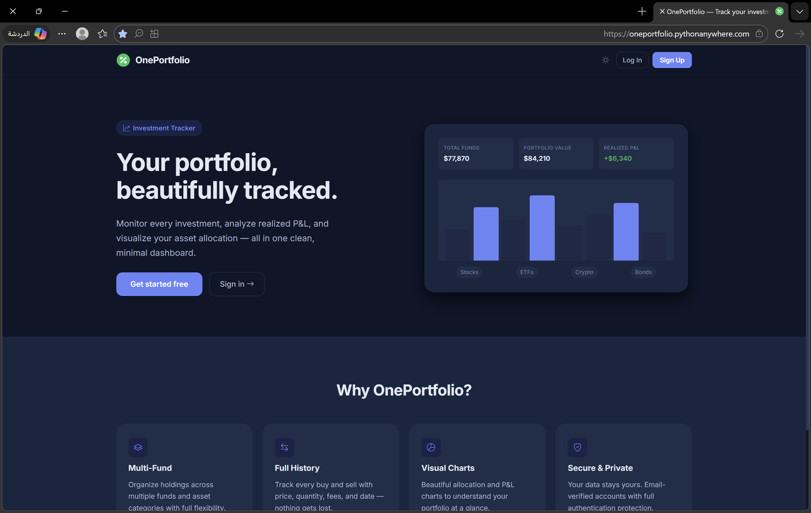

# OnePortfolio


> A web application for managing investment portfolios across multiple asset classes with transaction tracking, average cost computation, and realized P&L calculations — no external APIs required.

## Table of Contents

- [Features](#-features)
- [Tech Stack](#️-tech-stack)
- [Live Demo](#-live-demo)
- [Quick Start](#-quick-start)
- [Configuration](#-configuration)
- [Project Structure](#-project-structure)
- [Testing](#-testing)
- [Deployment](#-deployment)
- [Roadmap](#-roadmap)
- [License](#-license)

## ✨ Features

| Feature | Description |
|---------|-------------|
| **Multi-Asset Support** | Track Stocks, ETFs, Commodities, and Crypto |
| **Portfolio Overview** | Total portfolio value and realized ROI per category |
| **Fund Management** | Deposit/withdraw funds with a full audit trail |
| **Transaction Tracking** | Buy/sell operations with automatic average cost computation |
| **Realized P&L** | Automatic profit/loss calculations on every sale |
| **Email Verification** | 6-digit OTP sent to email on registration |
| **Password Reset** | Secure reset link sent via email (expires in 1 hour) |
| **Multi-User Auth** | Separate accounts with full data isolation; first user becomes admin |
| **Admin Panel** | Manage users, send password reset emails, toggle admin privileges |
| **REST API** | JSON endpoints for portfolio data integration |
| **Manual Entry** | Full control over your data, no third-party price feeds |

## 🛠️ Tech Stack

| Layer | Technology |
|-------|-----------|
| Backend | Python 3.8+ · Flask 3.0.0 |
| Database | SQLite · Flask-SQLAlchemy |
| Frontend | HTML5 · Bootstrap 5 · JavaScript |
| Auth | Flask-Login · Werkzeug password hashing |
| Email | Flask-Mail · Gmail SMTP |
| Forms | Flask-WTF |
| Testing | pytest |

## 🌐 Live Demo

👉 https://oneportfolio.pythonanywhere.com/

**Demo credentials:**

| Field | Value |
|-------|-------|
| Username | `demo` |
| Password | `demo1234` |

## 🚀 Quick Start

**Prerequisites:** Python 3.8+

```bash
# 1. Clone
git clone https://github.com/nasserx/OnePortfolio.git
cd OnePortfolio

# 2. Virtual environment
python -m venv venv
source venv/bin/activate        # Linux/Mac
.\venv\Scripts\activate         # Windows

# 3. Install dependencies
pip install -r requirements.txt

# 4. Run
python app.py
```

Open `http://localhost:5000` — the first registered account automatically becomes admin.

## 🔧 Configuration

Set the following environment variables (in `.env` or your hosting platform's WSGI file):

| Variable | Required | Description |
|----------|----------|-------------|
| `SECRET_KEY` | ✅ | Flask session signing key — generate with `secrets.token_hex(32)` |
| `EMAIL_USER` | ✅ | Gmail address used to send verification and reset emails |
| `EMAIL_PASSWORD` | ✅ | Gmail App Password (requires 2FA enabled on the account) |
| `APP_BASE_URL` | ✅ | Public URL of your app (e.g. `https://yourapp.pythonanywhere.com`) |
| `DATABASE_URL` | — | SQLAlchemy URI — defaults to `sqlite:///portfolio.db` |
| `SESSION_COOKIE_SECURE` | — | Set to `1` when serving over HTTPS |

> **Note:** Gmail requires an [App Password](https://myaccount.google.com/apppasswords) — your regular password will not work.

## 📁 Project Structure

```
OnePortfolio/
├── app.py                  # Development entry point
├── wsgi.py                 # Production WSGI entry point
├── config.py               # Configuration settings
├── requirements.txt        # Python dependencies
├── test_app.py             # Test suite
└── portfolio_app/
    ├── __init__.py         # App factory & DB migrations
    ├── models/             # SQLAlchemy models (User, Fund, Transaction, ...)
    ├── repositories/       # Data access layer
    ├── services/           # Business logic (auth, funds, portfolio, ...)
    ├── calculators/        # P&L and average cost calculators
    ├── forms/              # WTForms form validation
    ├── routes/             # Flask blueprints (auth, admin, dashboard, ...)
    ├── utils/              # Email, token, and formatting helpers
    ├── static/             # CSS and JS assets
    └── templates/          # Jinja2 HTML templates
```

## 🖼️ Screenshots

### Landing Page


## 🧪 Testing

```bash
pytest -v
```

CI runs automatically on every push via GitHub Actions across Python 3.8, 3.10, and 3.12.

## 🚀 Deployment

### PythonAnywhere

```bash
# 1. Clone your repo
git clone https://github.com/nasserx/OnePortfolio.git

# 2. Create and activate virtualenv
python3 -m venv venv
source venv/bin/activate
pip install -r requirements.txt
```

In the **WSGI file** on PythonAnywhere, set environment variables and activate the virtualenv:

```python
activate_this = '/home/YOUR_USERNAME/.virtualenvs/myenv/bin/activate_this.py'
with open(activate_this) as f:
    exec(f.read(), {'__file__': activate_this})

import os
os.environ['SECRET_KEY']            = 'your-secret-key'
os.environ['EMAIL_USER']            = 'your-gmail@gmail.com'
os.environ['EMAIL_PASSWORD']        = 'your-app-password'
os.environ['APP_BASE_URL']          = 'https://yourapp.pythonanywhere.com'
os.environ['SESSION_COOKIE_SECURE'] = '1'

from portfolio_app import create_app
application = create_app()
```

Then click **Reload** in the Web tab.

> **Note:** PythonAnywhere free accounts only allow outbound connections to whitelisted hosts. Use Gmail SMTP (`smtp.gmail.com:587`) which is supported.

## 🎯 Roadmap

- [ ] Live market price integration
- [x] Multi-user authentication with email verification
- [x] Password reset via email
- [ ] Advanced charts and analytics
- [ ] Docker deployment support

## 📝 License

MIT — see [LICENSE](LICENSE) for details.

**nasserx** · [@nasserx](https://github.com/nasserx)

---

> ⚠️ **Disclaimer:** This project is for educational and organizational purposes only. It does not provide financial advice.
